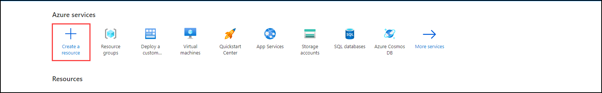
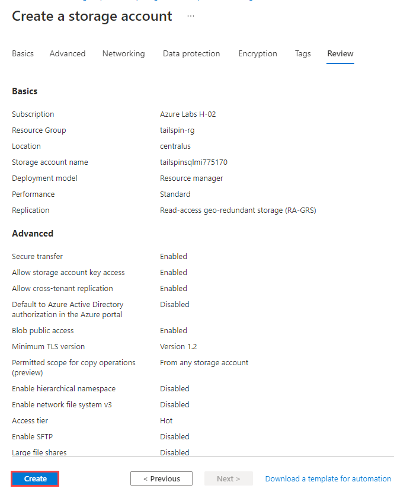
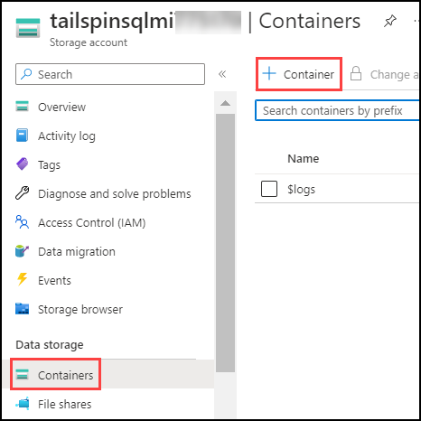

## Exercise 1: SQL database migration

Duration: 90 minutes

Tailspin Toys needs to migrate their on-premises SQL Server database to Azure SQL Managed Instance. This is part of the migration strategy defined to migrate Tailspin Toys workloads to Azure.

In this exercise, you will go through the steps necessary to migrate Tailspin Toys' on-premises SQL Server database to Azure SQL Managed Instance.

   [SQL database migration](#exercise-1-sql-database-migration)
   
   - [Task 1: Review Creation of Azure SQL MI **(Read-Only)** ](#task-1-review-creation-of-azure-sql-mi-read-only)
   
   - [Task 2: Install Data Migration Assistant](#task-2-install-data-migration-assistant)
   
   - [Task 3: Assess on-premises database compatibility](#task-3-assess-on-premises-database-compatibility)
   
   - [Task 4: Backup on-premises SQL database](#task-4-backup-on-premises-sql-database)
   
   - [Task 5: Migrate database to Azure SQL MI](#task-5-migrate-database-to-azure-sql-mi)

### Task 1: Review Creation of Azure SQL MI **(Read-Only)**
 
  > **Note**: This is a **Read-Only** task. As Deploying the new instance of Azure SQL Managed Instance may take about 6 hour to complete. We have already created a *Managed Instance* for you. You can review this task to understand how the Azure Managed Instance is created and continue from the next task.

1. On the **Home** page within the Azure Portal, towards the top, select **Create a resource**.

    

2. Within the **Search services and marketplace** field, type **Azure SQL Managed Instance**, press Enter, and select it in the search results.

    

3. Select **Create**.

     

4. On the **Create Azure SQL Managed Instance** pane, set the following values:

    - **Subscription**: Your Azure subscription for this lab from the drop-down.
    -  **Resource group**: Select the resource group `SQLMI-Shared-RG`.
    - **Managed Instance name**: Enter a unique name, such as `sqlmi--cus`.
    - **Region**: Select Region same as that of the resource group.

     

5. For **Compute + storage**, select **Configure Managed Instance**.

     

6. For the **Compute + storage** configured select the following values:

    - **Service tier**: General Purpose
    - **Hardware generation**: Standard-series
    - **vCores**: 8 vCores
    - **Storage in GB**: 64 GB

     

7. Select **Apply**.

8. Under **Authentication**, set the **Authentication Method** value to **Use both SQL and Azure AD authentication**.

9. Under **Azure AD admin**, select **Set admin** and choose an Azure AD user for the Azure AD admin. You should choose your own User account.

    > **Note**: To choose the Azure AD admin, an organization account must be selected. A personal Microsoft Account cannot be used for this.

10. Enter a username to use for the **Managed Instance admin login** and a **Password** for this new Administrator user that will be created on the database server. Select **Next: Networking**.

    > **Note**: You can provide the following credentials
        
         Username: demouser
         Password: demo!pass1234567

     

12. On the **Networking** pane, enter the following value and then select **Review + create**.

    - **Virtual network / subnet**: `vnet-sqlmi--cus/Management`. 

     

13. Select **Create**.

     

   
### Task 2: Install Data Migration Assistant

1. In the Azure Portal, navigate to the Resource Group for the lab i.e, `tailspin-rg` , then navigate to the `tailspin-onprem-sql-vm` virtual machine. This is the simulated on-premises SQL Server VM that contains the database to migrate to Azure SQL MI.

    

2. On the left, select **Bastion** under **Operations**.

    

3. Enter the **Username** and **Password**, then select **Connect**.
    
    > - **Username**: `demouser`
    > - **Password**: `demo!pass123`

    

4. In the **tailspin-onprem-sql-vm** virtual machine, go to **Server Manager**, and select **Local Server**.

    

5. Within **Local Server**, select the `On` text link for the **IE Enhanced Security Configuration** property.

    

6. On the **Internet Explorer Enhanced Security Configuration** dialog, select **Off** for **Administrators**, then select **OK**.

    

7. In the **tailspin-onprem-sql-vm** virtual machine, open **Internet Explorer** then go to the following link and download the **.NET Framework 4.8 Runtime** installer. This will be needed to install the Microsoft Data Migration Assistant. Select **Run** to run the **.NET Framework 4.8 Runtime** installer.

    <https://dotnet.microsoft.com/en-us/download/dotnet-framework/thank-you/net48-web-installer>
    
    
    
    

8. Once it's finished downloading, and follow the prompts to install the .NET Framework. Accept the license terms and click install.

    
    
9. After the installation is completed on the **Installation is complete** dialogue box click on **Finish**.

      
   
    - You will recieve a pop-up to restart your VM click on **Restart Now**.
     
     

10. Using **Internet Explorer**, go to the following link and download the **Microsoft Data Migration Assistant**.
   
    <https://www.microsoft.com/en-us/download/details.aspx?id=53595>  
   
    - Click on download for **Data Migration Assistant**.
    
     
   
     - Select **Run** to run the **Microsoft Data Migration Assistant** installer.
    
     

11. Once it's finished downloading and follow the prompts to install the assistant.

    - On **Welcome to the Microsoft Data Migration Assistant Setup Wizard** click **Next**.
    
     
    
    - Next on the **End-User License Agreement** accept the terms and click on **Next**.
    
     
    
     - On the **Privacy Statemen**t click on **Install**.  

      
      
      - Finally on the **Completed the Microsoft Data Migration Assistant Setup Wizard** click on **Finish**.
      
      

### Task 3: Assess on-premises database compatibility

1. In the **tailspin-onprem-sql-vm** virtual machine, open the **Start menu**, then type **Microsoft Data Migration Assistant** to search the application, then select it to run.

   

2. On the left, select the Plus sign (`+`) button to create a new project, and enter the following values, then select **Create**.

    - **Project type**: Assessment
    - **Project name**: Tailspin
    - **Assessment type**: Database Engine
    - **Source server type**: SQL Server
    - **Target server type**: Azure SQL Database Managed Instance

    

3. On the **Options** tab, ensure the **Check database compatibility** and **Check feature parity** report types are selected, then select **Next**.

    

4. On the **Connect to a server** prompt, enter `localhost` for the     **Server name**, and check the **Trust server certificate** option, then select **Connect**.

    

5. On the **Add sources** prompt, select the **WideWorldImporters** database, then select **Add**.

    

6. Select **Start Assessment** in the lower right.

    

7. On the **Review results** pane, you should see a message that states "**There are no feature parity issues with your server instance.**"

    

8. On the top left of the **Review results** pane, select **Compatibility issues**. On the **Review results** pane, you should see a message that "**There are no compatibility issues with your database**".

    

9. The Data Migration Assessment is complete. If there were feature parity or compatibility issues found, then you would need to address those before migrating the SQL Server database to Azure SQL MI.

### Task 4: Backup on-premises SQL database

1. In the **tailspin-onprem-sql-vm** virtual machine, open the **Start menu**, then type **Azure Data Studio** to search the application, then select it to run **Azure Data Studio**.

    

2. On the left, select the **Extensions** tab, then select the **Azure SQL Migration** extension and install it.

    
 
   > **Note**: If you recive an error Unable to install the extention. Update your Azure Data Studio and reperform Step 2. 
     
    
    
 
  
3. Next, you need to enable Preview Features within Azure Data Studio. Select the **Manage** icon (shown as the Gear in the lower left corner of Azure Data Studio) and select **Settings**.

     

4. On the **Settings** pane, type **Enable Preview Features** in the search box at the top, then check the **Enable unreleased preview features** box for the **Workbench: Enable Preview Features** option that shows in the search results. This will autosave.

     

5. Next, let's connect to the on-premises SQL Server. Select the **Connections** tab on the left side of Azure Data Studio, then select **New Connection**.

    

6. On the **Connection** pane, enter the following values to connect to the on-premises SQL database, then select **Connect**:

    - **Connection type**: Microsoft SQL Server
    - **Server**: `localhost`
    - **Authentication type**: Windows Authentication
    - **Database**: `WideWorldImporters`

    

7. In the list of servers, right-click the **localhost, WideWorldImporters** server, then select **Manage**.

    

8. Select **Backup**.

    

9. On the **Backup database** pane, make sure the **Backup type** is set to **Full**, select the **Reliability** option to **Perform checksum before writing to media**, then make a note of the location of the **Backup files**, and select **Backup**.

    

10. Open **Internet Explorer**, navigate to the following URL.

    <https://azure.microsoft.com/en-us/products/storage/storage-explorer/#overview>
    
    - Scroll to the bottom of the page and click download **Microsoft Azure Storage Explorer**.
    
    
    
    - Click **Run** on the installer pop-up.
    
    
     
     - On the **Setup-Microsoft Azure Storage Explorer** wizard accept the License agreement and leave all settings default and install.  

    

11. Launch **Microsoft Azure Storage Explorer**.

12. Select **Sign in with Azure**.

    

13. In the **Select Azure Environment** select **Azure**  for **Which Azure environment will you use to sign in?** and click **Next**.
     
     

    - Sign in to **Microsoft Account** using your ODL-user.

    
   
    - You will recive the following message after successfully logging in.
   
     

14. In the **Explorer** pane, expand the Azure Subscription, locate the Storage Account that was previously created (named similar to `tailspinsqlmistore`), then expand **Blob Container** and select the **sql-backup** container.

    

15. In the **sql-backup** container pane, select **Upload**, then select **Upload Files...**.

    

16. In the **Upload Files** dialog, in the **Selected files** field, select the **Database Backup File** (`.bak`) for the **WideWorldImporters** database that was previously created (C:\Backup), then select **Upload**.

    

### Task 5: Migrate database to Azure SQL MI

1. Within **Azure Data Studio**, under the list of servers, right-click the **localhost, WideWorldImporters** server, then select **Manage**.

    

2. Select the **Azure SQL Migration** option. Select the **Migrate to Azure SQL** button.

    

3. In **Step 1: Database for assessment**, select the **WideWorldImporters** database, then select **Next**.

    

4. In **Step 2: Assessment results and recommendations**, select the **Azure SQL Managed Instance** option.

    

5. Scroll down and select the **View/Select** button to select a database.

    

6. Select the **WideWorldImporters** database, and you should see a message stating `No issues for migrating to Azure SQL Managed Instance`., then select the **Select** button.

    

7. Verify the **Azure SQL Managed Instance** target is selected, notice that it now shows **1 of 1 databases selected**, then select **Next**.

    

8. In **Step 3: Azure SQL target**, enter connection information to your Azure Subscription by first clicking on **link account**.

    

9. On the **linked account** pane select **Add an account**.
    
    
    
10. Sign into your Azure account using the credentials provided in the **Environment details** page.

      
      
     - Once logged in successfully you will revice **Your account was added successfully!** message on the browser. 
       
     

11. Back on the Data studio,  **Linked accounts** select the Azure account that was added and **Close**.
 
        

12.  Now for **Step 3: Azure SQL target** enter the following connection information, then select **Next**.
     
       - **Subcription**: `Azure Labs H-02`
       - **Location**: `Central US`
       - **Resource group**: `SQLMI-Shared-RG`
       - **Azure SQL Managed Insatnce**: `sqlmi--cus`

       

13. On **Step 4: Migration mode**, keep **Online migration** selected, then select **Next**.

    

14. In **Step 5: Database backup**, select **My database backups are in an Azure Storage Blob Container**, provide the following details and then select **Next**.
 
    - **Target database name**: `WideWorldImporters`
    - **Resource group**: `tailspin-rg`
    - **Storage Account**: `tailspinsqlmistore`
    - **Blob container**: `sql-backup`

    

15. In **Step 6: Azure Database Migration Service**, select **Create new** under **Azure Database Migration Service**.

    

16. In the **Create Azure Database Migration Service** pane, enter the following values, then select **Create**.

    - **Resource group**: `tailspin-rg`.
    - **Name**: `tailspin-sql-migration`
    
    

17. Once the Database Migration Service has been created, select **Done**.

    

18. In **Step 6: Azure Database Migration Service**, select the **Azure Database Migration Service** that was created, then select **Next**.

    

19. In **Step 7: Summary**, review all the configurations chosen, then select **Start migration**.

    

20. Azure Data Studio will now show **Database migrations in progress - 1**.

    

21. In the Azure Portal, navigate to the **Azure Database Migration Service** that was created `tailspin-sql-migration` under `tailspin-rg`, then select **Migrations** and the **WideWorldImporters** migration.

    

22. The **WideWorldImporters** migration shows the current status of the migration as `InProgress`. Notice the **Currently restoring files** should say **All backups restored** once the database backup has been restored. Then select **Complete cutover** at the top.

    

23. In the **Complete cutover** prompt, select the box for **I confirm there are no additional log backups to provide and want to complete cutover.**, then select **Complete cutover**.

    

24. The **WideWorldImporters** Migration will now show the status of **Completing**. This will take a few minutes to complete.

    

25. Once the cutover has been completed, the **WideWorldImporters** migration will show a status of **Succeeded**.

    

26. Within the Azure Portal, type **Azure SQL Managed Instance** on the **Search resources, services and docs** and select **SQL managed instances**.

      
 
27. Under **SQL managed instances**, select **sqlmi--cus** Managed Instance.

      

28. When the SQL Server database migration to Azure SQL MI has completed, you will see the **WideWorldImporters** database shown with an **Online** status.

    
