## Exercise 2: Create VM to migrate web application

Duration: 30 minutes

In this exercise, you will create a new Windows Server 2022: Azure Edition virtual machine (VM) that will be the destination for migrating the on-premises Web Application to Azure, and then you will use Azure Bastion to connect to the VM over Remote Desktop (RDP). Azure Bastion will allow secure remote connections to the VM for Administrators. Windows Server Azure Edition is a specific image of Windows Server with unique capabilities such as rebootless patching with Hotpatch, available only on Azure.

- [Create VM to migrate web application](#exercise-2-create-vm-to-migrate-web-application)
  - [Task 1: Create Windows Server 2022 Azure Edition VM for application hosting](#task-1-create-windows-server-2022-azure-edition-vm-for-application-hosting)
  - [Task 2: Check remote desktop access](#task-2-check-remote-desktop-access)

### Task 1: Create Windows Server 2022 Azure Edition VM for application hosting

In this task, you will create a new Windows Server 2022: Azure Edition virtual machine (VM) that will be the destination for migrating the on-premises Web Application to Azure.

1. Sign in to the [Azure Portal](https://portal.azure.com). Ensure that you're using a subscription associated with the same resources you created during the Before the hands-on lab set up.

2. On the **Home** page within the Azure Portal, towards the top, select **Create a resource**.

    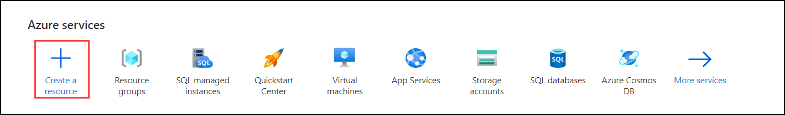

3. Within the **Search services and marketplace** field, type **Windows Server** and press Enter to search the marketplace, then select **Windows Server**.

      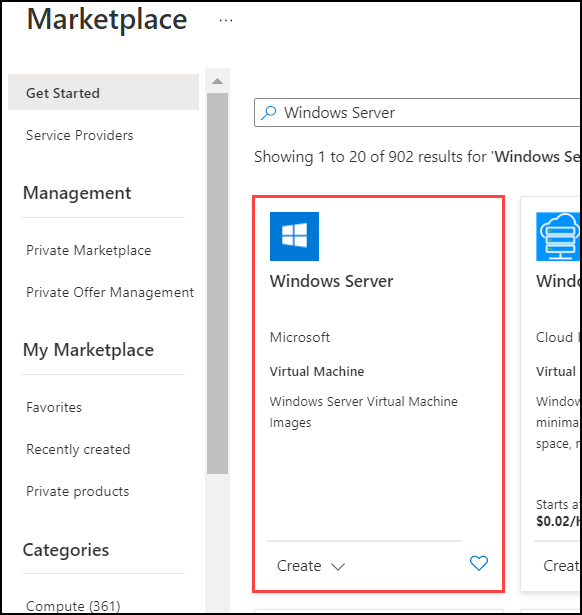

4. Choose **Windows Server 2022 Datacenter: Azure Edition**, then select **Create**.

      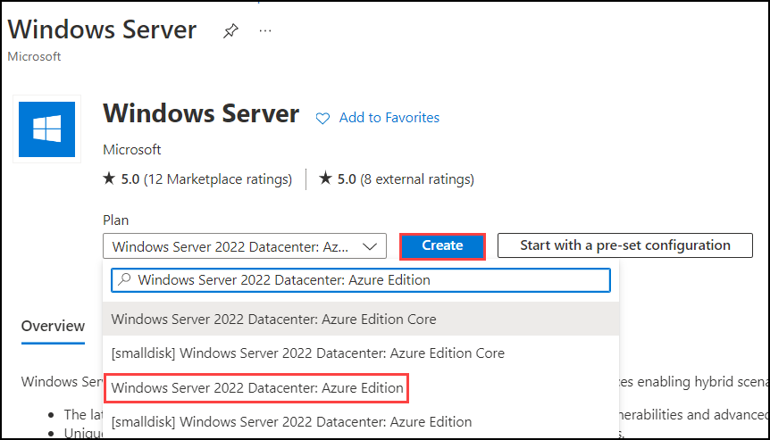

5. On the **Create a virtual machine** pane, set the following values to configure the new virtual machine:

    - **Resource group**: Select the resource group that you created for this lab. Such as `tailspin-rg`.
    - **Virtual machine name**: Give the VM a unique name, such as `tailspin-webapp-vm`.
    - **Region**: Select the Azure Region that was used to create the resource group.
    - **Image**: Verify the image is set to **Windows Server 2022 Datacenter: Azure Edition - Gen 2**.

      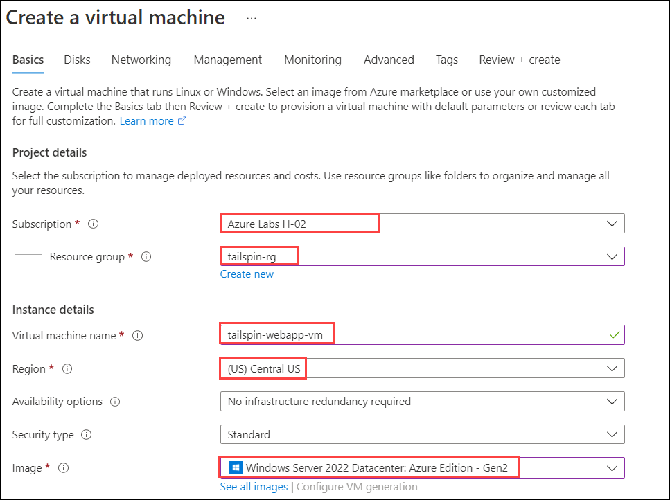

6. Set the **Size** field by selecting the **Standard_D4s_v5** virtual machine size. Set a **Username** and **Password** for the **Administrator account** for the VM.

     - **Username**: `demouser`
     - **Password**: `demo!pass123`
      
      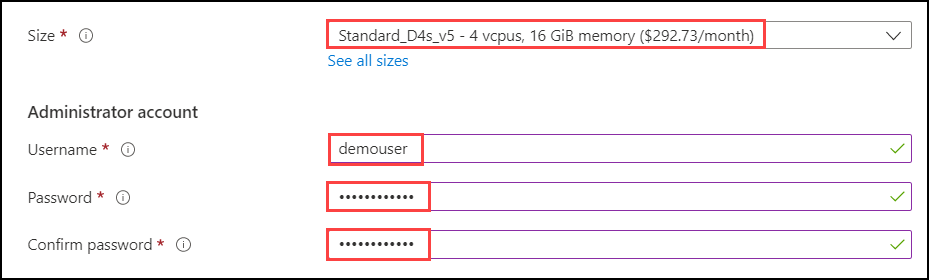

7. Select **Next** until you are navigated to the **Networking** tab of the **Create a virtual machine** page. Provision the VM in the Spoke VNet in Azure by selecting the following values under the **Network interface** section:

    - **Virtual network**: `vnet-sqlmi--cus`
    - **Subnet**: `Management1`
    - **Public IP**: `None`

     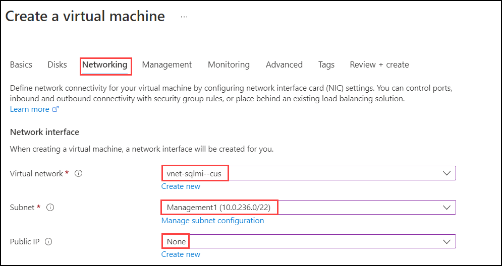

8. Set the following values to ensure that HTTPS traffic will be allowed to connect to the VM and select **Review + create** to review the virtual machine settings.

   - **Public inbound ports**: `Allow selected ports`
   - **Select inbound ports**: `HTTPS (443)`

    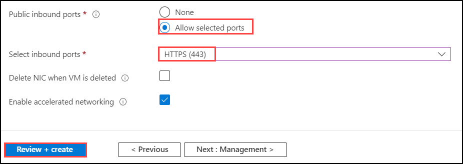

9. Select **Create** to begin provisioning the virtual machine once the **Validation passed** message is shown.

     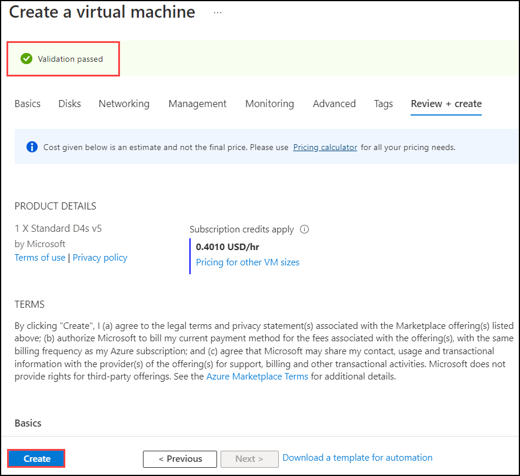

### Task 2: Check remote desktop access

In this task, you will test Remote Desktop (RDP) connectivity to the newly created virtual machine using Azure Bastion.

1. In the Azure Portal, navigate to the newly created **Virtual Machine**.

    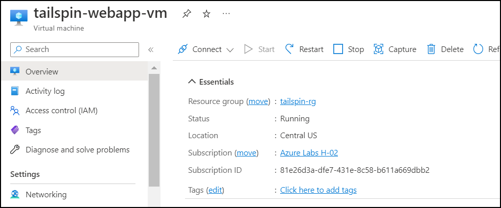

2. On the left, under the **Operations** section, select **Bastion**.

    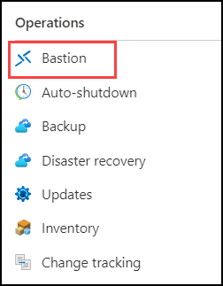

3. On the **Bastion** pane, enter the **Username** and **Password**, then select **Connect**.

     - **Username**: `demouser`
     - **Password**: `demo!pass123`

    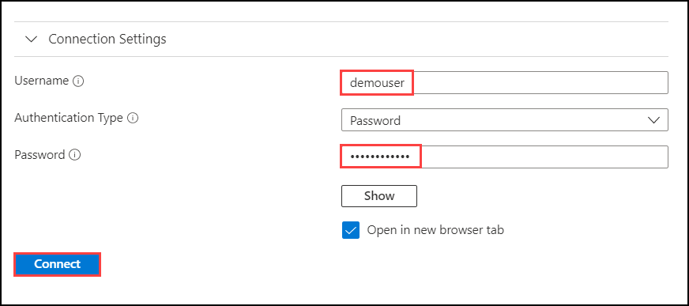

    > **Note**: The Azure Bastion instance named `tailspin-hub-bastion` was previously created with the Before the Hands-on lab setup. This is a required resource for using Azure Bastion to securely connect to Azure VMs using RDP from within the Azure Portal.

4. A new browser tab will open with Azure Bastion connected to the virtual machine over RDP. To close this session, you can close this browser tab.

    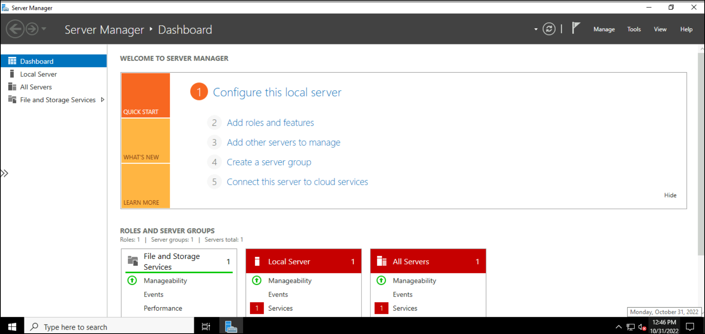

> **Note**: Now that the Windows Server 2022 VM has been created in Azure, Tailspin Toys will now be able to modify their Continuous Integration and Continuous Deployment (CD/CD) pipelines within Azure DevOps to begin deploying the Web Application code to this virtual machine as they get ready for migrating the application to Azure.
